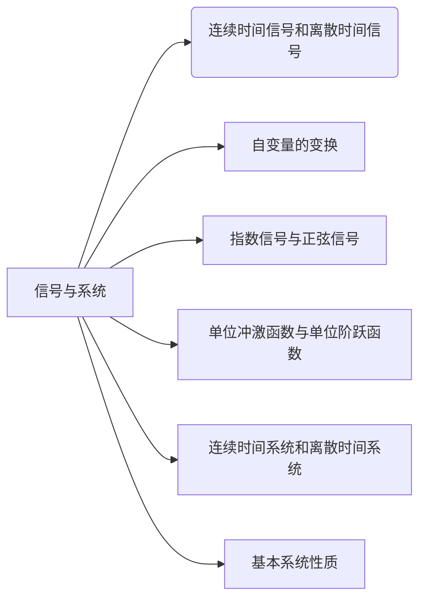

## 第一章	信号与系统[^1]

第1章从介绍和**信号与系统的数学表示**有关的某些基本概念入手，特别是讨论了一个**信号独立变量的某些变换**，接着介绍了某些最重要的基本连续时间信号和离散时间信号，即**实指数和复指数信号**、连续时间和离散时间**单位阶跃信号**和**单位冲激信号**等。

第1章还介绍了**系统互联的方框图表示**，并讨论了几个**基本的系统性质**。

本书中存在一种**分析体系**，也就是**一种描述信号与系统的语言和一整套分析它们的强有力的方法**，而这种语言和方法都能很好地应用于这些领域中所要解决的问题。本章从引入信号与系统的数学描述及其表示入手来建立这样一种分析体系的。
### 本章节结构组成：

### 本章小结：

[^1]:原书中 P~1-36~
